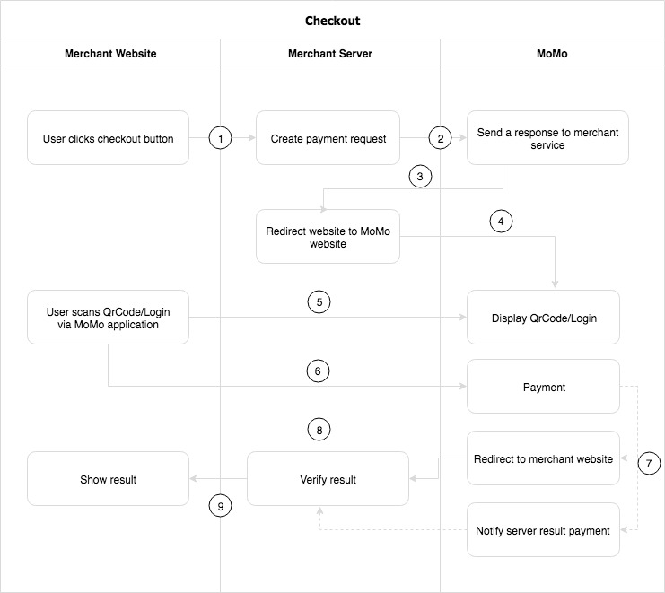
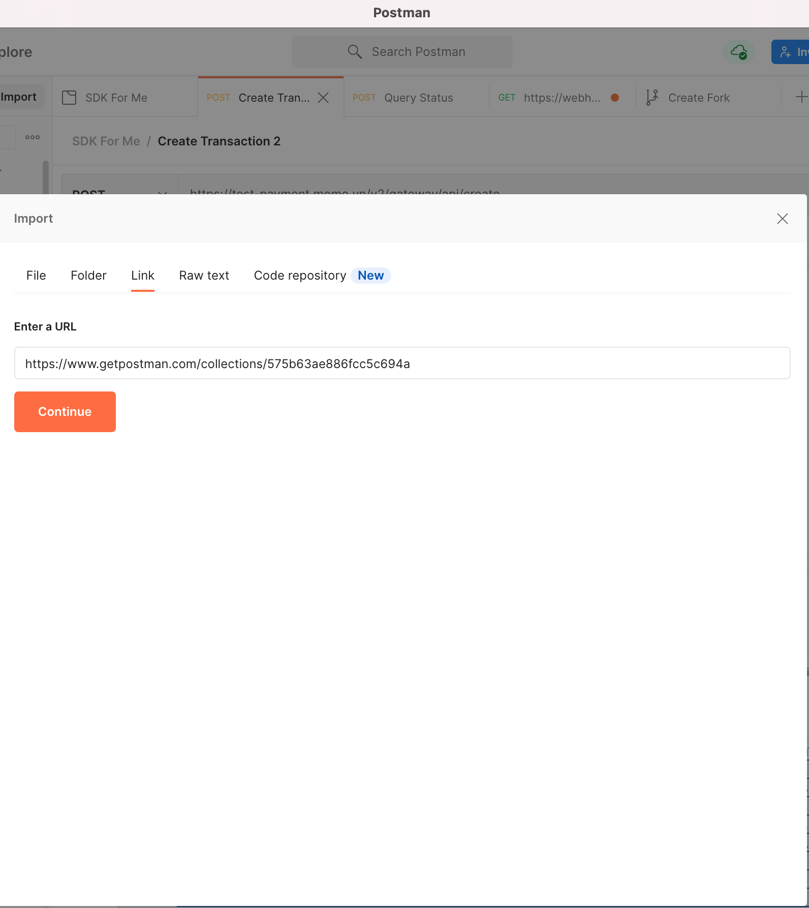
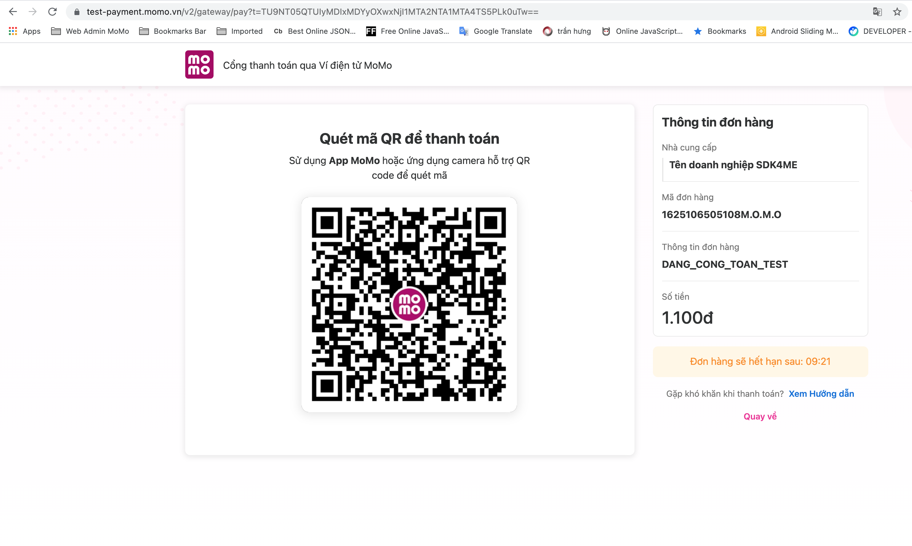

<!--
*** Thanks for checking out the Best-README-Template. If you have a suggestion
*** that would make this better, please fork the repo and create a pull request
*** or simply open an issue with the tag "enhancement".
*** Thanks again! Now go create something AMAZING! :D
-->

<!-- PROJECT SHIELDS -->
<!--
*** I'm using markdown "reference style" links for readability.
*** Reference links are enclosed in brackets [ ] instead of parentheses ( ).
*** See the bottom of this document for the declaration of the reference variables
*** for contributors-url, forks-url, etc. This is an optional, concise syntax you may use.
*** https://www.markdownguide.org/basic-syntax/#reference-style-links
-->

<!-- PROJECT LOGO -->
<br />
<p align="center">
  <a href="https://developers.momo.vn/#/docs/aiov2/">
    
  </a>

<h3 align="center">SDK MOMO FOR ME</h3>

  <p align="center">
    Hướng dẫn tốt nhất dành cho bạn
    <br />
    <a href="https://developers.momo.vn/#/docs/aiov2/"><strong>Tài liệu gốc »</strong></a>
    <br />
    <br />
    <a href="https://test-payment.momo.vn/demo/#/">View Demo</a>
    ·
    <a href="https://developers.momo.vn/#/docs/feedback">Report Bug</a>
    ·
    <a href="https://business.momo.vn/login">Request Feature</a>
  </p>


[comment]: <> (<!-- TABLE OF CONTENTS -->)

[comment]: <> (<details open="open">)

[comment]: <> (  <summary>Mục lục</summary>)

[comment]: <> (  <ol>)

[comment]: <> (    <li>)

[comment]: <> (      <a href="#i-gi%E1%BB%9Bi-thi%E1%BB%87u">Giới thiệu</a>)

[comment]: <> (      <ul>)

[comment]: <> (        <li><a href="#built-with">Mục tiêu</a></li>)

[comment]: <> (      </ul>)

[comment]: <> (    </li>)

[comment]: <> (    <li>)

[comment]: <> (      <a href="#getting-started">Getting Started</a>)

[comment]: <> (      <ul>)

[comment]: <> (        <li><a href="#prerequisites">Prerequisites</a></li>)

[comment]: <> (        <li><a href="#installation">Installation</a></li>)

[comment]: <> (      </ul>)

[comment]: <> (    </li>)

[comment]: <> (    <li><a href="#usage">Usage</a></li>)

[comment]: <> (    <li><a href="#roadmap">Roadmap</a></li>)

[comment]: <> (    <li><a href="#contributing">Contributing</a></li>)

[comment]: <> (    <li><a href="#license">License</a></li>)

[comment]: <> (    <li><a href="#contact">Contact</a></li>)

[comment]: <> (    <li><a href="#acknowledgements">Acknowledgements</a></li>)

[comment]: <> (  </ol>)

[comment]: <> (</details>)


<!-- ABOUT -->
# I. Giới thiệu
Nhầm hỗ trợ các đối tác tích hợp các giải pháp thanh toán của MoMo. Tài liệu này sẽ hướng dẫn các bạn cách tích hợp tối ưu nhất.

* Giải pháp toàn vẹn - Cổng thanh toán [ALL IN ONE](https://developers.momo.vn/#/docs/aiov2/) version 2 (AIOv2).
  <br>
  AIOv2 là giải pháp thanh toán của MoMo áp dụng trên nhiều nền tảng khác nhau chỉ trong một API duy nhất.

### Mục tiêu

* Nhầm giúp đối tác lựa chọn giải pháp thanh toán phù hợp
* Tích hợp nhanh chóng, chính xác, hiệu quả
* Hạn chế rủi ro trong quá trình tích hợp


<!-- GETTING STARTED -->
# II. Lựa chọn giải pháp

[AIOv2](https://developers.momo.vn/#/docs/aiov2/) là giải pháp thanh toán của MoMo áp dụng trên nhiều nền tảng khác nhau chỉ trong một API duy nhất.


[comment]: <> (```bigquery)

[comment]: <> (Trên môi trường thật &#40;production&#41;: )

[comment]: <> (Bạn phải yêu cầu Bộ phận kinh doanh của MoMo, để được cung cấp quyền truy cập:)

[comment]: <> (qrCodeUrl, deeplink, deeplinkWebInApp, deeplinkMiniApp, Refund)

[comment]: <> (```)

## Sơ đồ xử lý
Sơ đồ thanh toán đơn hàng trên website desktop/mobile
<p align="left">
    
</p>

Thanh toán trên Smart Tivi
<p align="left">
    
</p>

## Mô hình thanh toán
Tham khảo hướng dẫn sau để áp dụng MoMo vào trang mua hàng của bạn

* Bước 1: Khách hàng kiểm tra đơn hàng và chọn MoMo là phương thức thanh toán
* Bước 2: Server của bạn tạo session thanh toán và gửi yêu cầu thanh toán qua MoMo
* Bước 3: Chuyển trang mua hàng sang trang thanh toán của MoMo.
* Bước 4: Khách hàng sử dụng ứng dụng MoMo để quét mã QR hoặc đăng nhập app MoMo để thanh toán
* Bước 5: Sau khi thanh toán xong MoMo sẽ chuyển khách hàng về trang mua hàng
* Bước 6: Server của bạn xác thực giao dịch và cập nhật dịch vụ cho khách hàng

# III. Thông tin chung
* <b>Domain</b>

| Environment | Domain |
| --- | ----------- |
| Production | https://payment.momo.vn |
| Test | https://test-payment.momo.vn |

* <b>IP Address</b>

| Environment | Incoming    | Outcoming  |
| ---         | ----------- |----------- |
| Production  | 210.245.113.71 |118.69.210.244|
| Test        | 118.69.212.158 |118.69.210.244|

* <b>HTTP Request</b>

| Key | Value |
| --- | ----------- |
| Content-Type | application/json; charset=UTF-8 |
| Method | POST |
| HTTP Status Code | 200 |

* <b>List API SDK MOMO</b>

| API Name | Path | Docs |
| --- | ----------- |--- |
| Create Transaction v2 | /v2/gateway/api/create | [[link]](https://developers.momo.vn/#/docs/aiov2/?id=l%e1%ba%a5y-ph%c6%b0%c6%a1ng-th%e1%bb%a9c-thanh-to%c3%a1n) |
| Query Transaction v2 | /v2/gateway/api/query | [[link]](https://developers.momo.vn/#/docs/aiov2/?id=ki%e1%bb%83m-tra-tr%e1%ba%a1ng-th%c3%a1i-giao-d%e1%bb%8bch) |
| Refund Transaction v2| /v2/gateway/api/refund | [[link]](https://developers.momo.vn/#/docs/aiov2/?id=ho%c3%a0n-ti%e1%bb%81n-giao-d%e1%bb%8bch) |

* <b>List API listen reesult-transaction from MoMo (Partner must-have)</b>

| API Name | Url | Docs |
| --- | ----------- |--- |
| redirectUrl | http(s)://domain.partner.vn/redirect/ | [[link]](https://developers.momo.vn/#/docs/aiov2/?id=giao-di%e1%bb%87n-redirect) |
| ipnUrl | http(s)://domain.partner.vn/ipn/ | [[link]](https://developers.momo.vn/#/docs/aiov2/?id=ipn-instant-payment-notification) |

Tool Debug [API redirectUrl & ipnUrl](https://developers.momo.vn/#/docs/aio/?id=debug) hỗ trợ trong quá trình dev

# IV. Create Account
> Warning! Vui lòng không chia sẻ KEY Production cho bất cứ ai, chúng tôi
sẽ không xử lý những trường hợp KEY Production bị phát tán ra ngoài.

Đăng ký [Create Account Test](https://test-business.momo.vn/signup)
<br>
Đăng ký [Create Account Production](https://business.momo.vn/signup)
<details><summary>CLICK ME !!! Account Test tạo sẵn</summary>
<p>

| Key Test | Value |
| --- | ----------- |
| partnerCode | MOMONPMB20210629|
| partnerName | Tên doanh nghiệp SDK4ME|
| accessKey | Q2XhhSdgpKUlQ4Ky|
| secretKey | k6B53GQKSjktZGJBK2MyrDa7w9S6RyCf|
| userwame | sdk_4_me |
| password | sdk_4_me! |
</p>
</details>
<br>
<details><summary>CLICK ME !!! POSTMAN import »</summary>
<p align="left">
https://www.getpostman.com/collections/575b63ae886fcc5c694a
<br>
Import postman theo hình minh họa bên dưới
<br>

</p>
</details>

# V. Call Api
## 1. Create Transaction (Lấy phương thức thanh toán) [docs link](https://developers.momo.vn/#/docs/aiov2/?id=l%e1%ba%a5y-ph%c6%b0%c6%a1ng-th%e1%bb%a9c-thanh-to%c3%a1n)
>POST <span style="color:orange">/v2/gateway/api/create</span>

* HTTP Request

|Attribute	|Type	|Required	|Description|
|---|---|---|---|
|partnerCode	|String|	√|	<a href="#iv-create-account">Thông tin tích hợp</a> |
|partnerName	|String|	|	Tên đối tác|
|storeId	|String|		|Thông tin cửa hàng|
|requestId	|String|	√|	Định danh mỗi yêu cầu|
|amount	|Long|	√|	Số tiền cần thanh toán. tối thiểu 1.000 VND tối đa 20.000.000 VND. Tiền tệ: VND|
|orderId	|String|	√|	Mã đơn hàng thanh toán của đối tác (duy nhất không trùng lập)|
|orderInfo	|String|	√|	Thông tin đơn hàng mô tả|
|redirectUrl	|String|	√|	Một URL của đối tác. URL này được sử dụng để chuyển trang (redirect) từ MoMo về trang mua hàng của đối tác sau khi khách hàng thanh toán. Hỗ trợ: <details><summary><span style="color:orange">AppLink và WebLink</span></summary><p>Tìm hiểu thêm về AppLink<br>Android: https://developer.android.com/training/app-links <br>IOS: https://developer.apple.com/documentation/uikit/core_app/.. </p></details></span>|
|ipnUrl	|String|	√|	API của đối tác. Được MoMo sử dụng để gửi kết quả thanh toán theo phương thức IPN (server-to-server)|
|requestType	|String|	√|	<span style="color:red">captureWallet</span>|
|extraData	|String|	√|	Mặc định là trống "", Encode base64 theo định dạng Json: {"key":"value"}. VD với dữ liệu: {"username": "SDK4ME"} thì data của extraData là eyJ1c2VybmFtZSI6ICJTREs0TUUifQ==|
|lang	|String|	√|	Ngôn ngữ của message được trả về (vi hoặc en)|
|signature	|String|	√|	Chữ ký. Sử dụng thuật toán Hmac_SHA256 với các key-value được *__sắp xếp theo format A-Z__* |

>signature = <span style="color:orange">HMAC_SHA256</span>(accessKey=$accessKey&amount=$amount&extraData=$extraData&ipnUrl=$ipnUrl&orderId=$orderId&orderInfo=$orderInfo&partnerCode=$partnerCode&redirectUrl=$redirectUrl&requestId=$requestId&requestType=$requestType, <span style="color:orange">secretKey</span>)

* HTTP Response

|Attribute	|Type	|Required	|Description|
|---|---|---|---|
|partnerCode	|String|	√|	<a href="#iv-create-account">Thông tin tích hợp</a> |
|requestId	|String|	√|	Giống với yêu cầu ban đầu|
|orderId	|String|	√	|Mã đơn hàng của đối tác|
|amount	|Long|	√|	Giống với số tiền yêu cầu ban đầu|
|responseTime	|Long|	√|	Thời gian trả kết quả thanh toán về đối tác. Vd: 1625030045458|
|message	|String|	√|	Mô tả lỗi (tiếng Anh hoặc tiếng Việt dựa vào biến "land"|
|resultCode	|int|	√|	Mã lỗi >>|
|payUrl	|String|	√|	URL để chuyển từ trang mua hàng của đối tác sang trang thanh toán của MoMo|
|deeplink	|String|	|URL để mở ứng dụng trực tiếp MoMo (Khách hàng phải cài đặt ứng dụng MoMo trước) và trang xác nhận thanh toán.|
|qrCodeUrl	|String|	|	Dữ liệu để tạo mã QR nếu bạn muốn khách hàng quét mã QR trực tiếp trên trang mua hàng hoặc in mã lên hoá đơn.<br>Lưu ý: Đây không phải URL chứa hình ảnh của mã QR, bạn cần sử dụng thư viện ngoài để tạo mã QR.|
|deeplinkMiniApp	|String|	|	URL mở màn hình xác nhận thanh toán của ứng dụng MoMo. Áp dụng khi đối tác sử dụng mini app nhúng vào trong ứng dụng MoMo|

>⚠️⚠️⚠️ LƯU Ý: Bạn phải yêu cầu quyền truy cập để sử dụng những trường qrCodeUrl, deeplink, deeplinkMiniApp.

DATA Example
<br>
https://test-payment.momo.vn/v2/gateway/api/create
<br>
Request Body

```json
{
  "partnerCode": "MOMONPMB20210629",
  "partnerName": "Tên doanh nghiệp SDK4ME",
  "storeId": "MOMONPMB20210629_1",
  "requestId": "requestId_1624943052612",
  "amount": 1100,
  "orderId": "orderId_1624943052612",
  "orderInfo": "Demo tích hợp SDK MOMO",
  "redirectUrl": "http(s)://domain.partner.vn/redirect/",
  "ipnUrl": "http(s)://domain.partner.vn/ipn/",
  "requestType": "captureWallet",
  "extraData": "eyJ1c2VybmFtZSI6ICJtb21vIn0=",
  "lang": "vn",
  "signature": "3084afbc257bc556d60efbffab14b4358874572a30d9e3ed7676b9d96dd27c91"
}
```
Response Body
```json
{
  "partnerCode": "MOMONPMB20210629",
  "requestId": "requestId_1624943052612",
  "orderId": "MOMONPMB20210629_1",
  "amount": 1100,
  "responseTime": 1624945082867,
  "message": "Thành công",
  "resultCode": 0,
  "payUrl": "https://test-payment.momo.vn/v2/gateway/pay?t=TU9NT05QTUIyMDIxMDYyOXwxNjI0OTQ1MDgyMTU3TS5PLk0uTw==",
  "deeplink": "momo://?action=payWithAppToken&amount=1100&cashInId=&cashInIdPay=&createdAt=1624945082867&deeplinkCallback=&description=DANG_CONG_TOAN_TEST&extra=&extraData=&extras=&gatewayMerchantCode=MOMONPMB20210629&gatewaySessionId=TU9NT05QTUIyMDIxMDYyOXwxNjI0OTQ1MDgyMTU3TS5PLk0uTw==&gatewayVersion=3.0&giftIds=&isScanQR=false&language=vi&merchantcode=MOMONPMB20210629&merchantname=T%C3%AAn+doanh+nghi%E1%BB%87p+SDK4ME&merchantnamelabel=Nh%C3%A0+cung+c%E1%BA%A5p&orderId=1624945082157M.O.M.O&orderLabel=M%C3%A3+%C4%91%C6%A1n+h%C3%A0ng&partnerCode=MOMONPMB20210629&partnerName=T%C3%AAn+doanh+nghi%E1%BB%87p+SDK4ME&prepaidIds=&requestId=1624945082157M.O.M.O&requestType=payment&serviceType=deeplink&signature=d0cd686b15471f7cb3eed3bf8ab52941ebcbbf6c8a932b1dfc13b77640516a1a&storeId=MOMONPMB20210629&storeName=T%C3%AAn+doanh+nghi%E1%BB%87p+SDK4ME&type=&urlSubmitToken=https%3A%2F%2Fmomo.vn",
  "qrCodeUrl": "https://test-payment.momo.vn/v2/gateway/app?isScanQr=true&t=TU9NT05QTUIyMDIxMDYyOXwxNjI0OTQ1MDgyMTU3TS5PLk0uTw==",
  "deeplinkMiniApp": "momo://?action=payWithAppToken&amount=1100&cashInId=&cashInIdPay=&createdAt=1624945082867&deeplinkCallback=&description=DANG_CONG_TOAN_TEST&extra=&extraData=&extras=&gatewayMerchantCode=MOMONPMB20210629&gatewaySessionId=TU9NT05QTUIyMDIxMDYyOXwxNjI0OTQ1MDgyMTU3TS5PLk0uTw==&gatewayVersion=3.0&giftIds=&isScanQR=false&language=vi&merchantcode=MOMONPMB20210629&merchantname=T%C3%AAn+doanh+nghi%E1%BB%87p+SDK4ME&merchantnamelabel=Nh%C3%A0+cung+c%E1%BA%A5p&orderId=1624945082157M.O.M.O&orderLabel=M%C3%A3+%C4%91%C6%A1n+h%C3%A0ng&partnerCode=MOMONPMB20210629&partnerName=T%C3%AAn+doanh+nghi%E1%BB%87p+SDK4ME&prepaidIds=&requestId=1624945082157M.O.M.O&requestType=payment&serviceType=miniapp&signature=d0cd686b15471f7cb3eed3bf8ab52941ebcbbf6c8a932b1dfc13b77640516a1a&storeId=MOMONPMB20210629&storeName=T%C3%AAn+doanh+nghi%E1%BB%87p+SDK4ME&type=&urlSubmitToken=https%3A%2F%2Fmomo.vn"
}
```

<h2 id="custom-id">2. Payment</h2>

> CHỌN 1 TRONG 4 phương thức: payUrl, deeplink, qrCodeUrl, deeplinkMiniApp<br>

> Ở tại bước thanh toán trên nền tảng ⚠️WEB của đối tác Desktop/Mobile.<br>

<details><summary>Phương thức 1: payUrl (thông dụng và phổ biến nhất)</summary>
<p align="left">

</p>
Open URL payUrl để chuyển từ trang mua hàng của đối tác sang trang thanh toán của MoMo.  Mã QR sẽ hết hạn trong 5 phút (có thể thay đổi theo yêu cầu của đối tác)
</details>
<br>
<details><summary>Phương thức 2: qrCodeUrl</summary>
<p align="left">

</p>
Dữ liệu qrCodeUrl để tạo mã QR. Khách hàng quét mã QR trực tiếp trên trang mua hàng hoặc in mã lên hoá đơn. Mã QR sẽ hết hạn trong 5 phút (có thể thay đổi theo yêu cầu của đối tác)
</details>

>Ở tại bước thanh toán trên nền tảng **⚠️APP** của đối tác
<details><summary>Phương thức 3: deeplink (App-in-app, Mobile Web)</summary>
App-in-app : App đối tác - 


<p align="left"></details>
<br>
<details><summary>Phương thức 4: deeplinkMiniApp (Đang cập nhật)</summary><p align="left">
Dành cho đối tác có MiniApp nằm trong Siêu App MoMo
</details>


## 1. Create Transaction (Lấy phương thức thanh toán) [docs link](https://developers.momo.vn/#/docs/aiov2/?id=l%e1%ba%a5y-ph%c6%b0%c6%a1ng-th%e1%bb%a9c-thanh-to%c3%a1n)


[comment]: <> (* npm)

[comment]: <> (  ```sh)

[comment]: <> (  npm install npm@latest -g)

[comment]: <> (  ```)

[comment]: <> (### Installation)

[comment]: <> (1. Get a free API Key at [https://example.com]&#40;https://example.com&#41;)

[comment]: <> (2. Clone the repo)

[comment]: <> (   ```sh)

[comment]: <> (   git clone https://github.com/your_username_/Project-Name.git)

[comment]: <> (   ```)

[comment]: <> (3. Install NPM packages)

[comment]: <> (   ```sh)

[comment]: <> (   npm install)

[comment]: <> (   ```)

[comment]: <> (4. Enter your API in `config.js`)

[comment]: <> (   ```JS)

[comment]: <> (   const API_KEY = 'ENTER YOUR API';)

[comment]: <> (   ```)


[comment]: <> (<!-- USAGE EXAMPLES -->)

[comment]: <> (## Usage)

[comment]: <> (Use this space to show useful examples of how a project can be used. Additional screenshots, code examples and demos work well in this space. You may also link to more resources.)

[comment]: <> (_For more examples, please refer to the [Documentation]&#40;https://example.com&#41;_)


[comment]: <> (<!-- ROADMAP -->)

[comment]: <> (## Roadmap)

[comment]: <> (See the [open issues]&#40;https://github.com/othneildrew/Best-README-Template/issues&#41; for a list of proposed features &#40;and known issues&#41;.)


[comment]: <> (<!-- CONTRIBUTING -->)

[comment]: <> (## Contributing)

[comment]: <> (Contributions are what make the open source community such an amazing place to be learn, inspire, and create. Any contributions you make are **greatly appreciated**.)

[comment]: <> (1. Fork the Project)

[comment]: <> (2. Create your Feature Branch &#40;`git checkout -b feature/AmazingFeature`&#41;)

[comment]: <> (3. Commit your Changes &#40;`git commit -m 'Add some AmazingFeature'`&#41;)

[comment]: <> (4. Push to the Branch &#40;`git push origin feature/AmazingFeature`&#41;)

[comment]: <> (5. Open a Pull Request)


[comment]: <> (<!-- LICENSE -->)

[comment]: <> (## License)

[comment]: <> (Distributed under the MIT License. See `LICENSE` for more information.)


[comment]: <> (<!-- CONTACT -->)

[comment]: <> (## Contact)

[comment]: <> (Your Name - [@your_twitter]&#40;https://twitter.com/your_username&#41; - email@example.com)

[comment]: <> (Project Link: [https://github.com/your_username/repo_name]&#40;https://github.com/your_username/repo_name&#41;)


[comment]: <> (<!-- ACKNOWLEDGEMENTS -->)

[comment]: <> (## Acknowledgements)

[comment]: <> (* [GitHub Emoji Cheat Sheet]&#40;https://www.webpagefx.com/tools/emoji-cheat-sheet&#41;)

[comment]: <> (* [Img Shields]&#40;https://shields.io&#41;)

[comment]: <> (* [Choose an Open Source License]&#40;https://choosealicense.com&#41;)

[comment]: <> (* [GitHub Pages]&#40;https://pages.github.com&#41;)

[comment]: <> (* [Animate.css]&#40;https://daneden.github.io/animate.css&#41;)

[comment]: <> (* [Loaders.css]&#40;https://connoratherton.com/loaders&#41;)

[comment]: <> (* [Slick Carousel]&#40;https://kenwheeler.github.io/slick&#41;)

[comment]: <> (* [Smooth Scroll]&#40;https://github.com/cferdinandi/smooth-scroll&#41;)

[comment]: <> (* [Sticky Kit]&#40;http://leafo.net/sticky-kit&#41;)

[comment]: <> (* [JVectorMap]&#40;http://jvectormap.com&#41;)

[comment]: <> (* [Font Awesome]&#40;https://fontawesome.com&#41;)


[comment]: <> (<!-- MARKDOWN LINKS & IMAGES -->)

[comment]: <> (<!-- https://www.markdownguide.org/basic-syntax/#reference-style-links -->)

[comment]: <> ([contributors-shield]: https://img.shields.io/github/contributors/othneildrew/Best-README-Template.svg?style=for-the-badge)

[comment]: <> ([contributors-url]: https://github.com/othneildrew/Best-README-Template/graphs/contributors)

[comment]: <> ([forks-shield]: https://img.shields.io/github/forks/othneildrew/Best-README-Template.svg?style=for-the-badge)

[comment]: <> ([forks-url]: https://github.com/othneildrew/Best-README-Template/network/members)

[comment]: <> ([stars-shield]: https://img.shields.io/github/stars/othneildrew/Best-README-Template.svg?style=for-the-badge)

[comment]: <> ([stars-url]: https://github.com/othneildrew/Best-README-Template/stargazers)

[comment]: <> ([issues-shield]: https://img.shields.io/github/issues/othneildrew/Best-README-Template.svg?style=for-the-badge)

[comment]: <> ([issues-url]: https://github.com/othneildrew/Best-README-Template/issues)

[comment]: <> ([license-shield]: https://img.shields.io/github/license/othneildrew/Best-README-Template.svg?style=for-the-badge)

[comment]: <> ([license-url]: https://github.com/othneildrew/Best-README-Template/blob/master/LICENSE.txt)

[comment]: <> ([linkedin-shield]: https://img.shields.io/badge/-LinkedIn-black.svg?style=for-the-badge&logo=linkedin&colorB=555)

[comment]: <> ([linkedin-url]: https://linkedin.com/in/othneildrew)

[comment]: <> ([product-screenshot]: images/screenshot.png)


[comment]: <> (| Syntax      | Description | Test Text     |)

[comment]: <> (| :---        |    :----:   |          ---: |)

[comment]: <> (| Header      | Title       | Here's this   |)

[comment]: <> (| Paragraph   | Text        | And more      |)


[comment]: <> (| Syntax | Description |)

[comment]: <> (| --- | ----------- |)

[comment]: <> (| Header | Title |)

[comment]: <> (| Paragraph | Text |)

Here's a sentence with a footnote. [^1]
[^1]: This is the footnote.

### My Great Heading {#custom-id}
<h6 id="custom-id"></h3>


term
: definition

- [x] Write the press release
- [ ] Update the website
- [ ] Contact the media