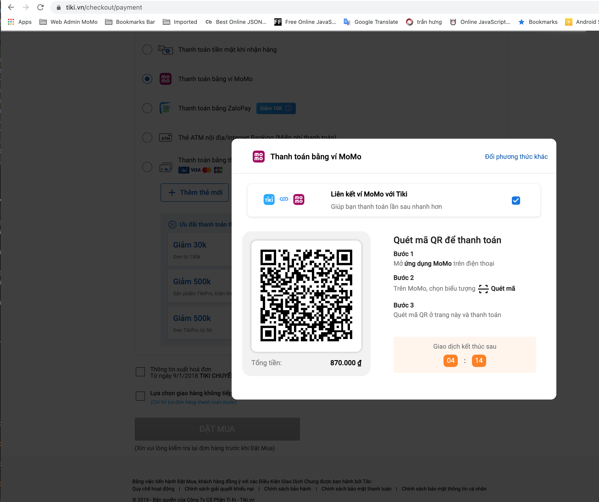

<!-- PROJECT LOGO -->
<br />
<p align="center">
  <a href="https://developers.momo.vn/#/docs/aiov2/">
    
  </a>

<h3 align="center">SDK MOMO FOR ME</h3>

  <p align="center">
    Hướng dẫn tốt nhất dành cho bạn
    <br />
    <a href="https://developers.momo.vn/#/docs/aiov2/"><strong>Tài liệu gốc »</strong></a>
    <br />
    <br />
    <a href="https://test-payment.momo.vn/demo/#/">View Demo</a>
    ·
    <a href="https://developers.momo.vn/#/docs/feedback">Report Bug</a>
    ·
    <a href="https://business.momo.vn/login">Request Feature</a>
  </p>

<!-- TABLE OF CONTENTS -->

<details open="open"><summary>MỤC LỤC</summary>
  <ol>
    <a href="#1">I. Giới thiệu</a>
    <br><a href="#2">II. Thông tin chung - HTTP Info</a>
    <br><a href="#3">III. Create Account M4B (MoMo For Business)</a>
    <br><a href="#4">IV. Call Api (Lấy phương thức thanh toán)</a>
    <ul>
      <li><a href="#4.1">1. Create Transaction</a></li>
      <li><a href="#4.2">2. Payment</a></li>
      <li><a href="#4.3">3. MoMo return result</a></li>
      <li><a href="#4.4">4. API check transaction status</a></li>
      <li><a href="#4.5">5. API refund</a></li>
    </ul>
    <a href="#5">V. Result Code (Bảng mã lỗi của MoMo)</a>
    <br><a href="#6">VI. IPN - Instant Payment Notification</a>
    <br><a href="#7">VII. QUY TRÌNH TEST - ACCOUNT TEST</a>
  </ol>
</details>


<!-- ABOUT -->
<h1 id="1">I. Giới thiệu</h1>

Nhầm hỗ trợ các đối tác tích hợp các giải pháp thanh toán của MoMo. Tài liệu này sẽ hướng dẫn các bạn cách tích hợp tối ưu nhất.

* Giải pháp toàn vẹn - Cổng thanh toán [ALL IN ONE](https://developers.momo.vn/#/docs/aiov2/) version 2 (AIOv2).
  <br>
  AIOv2 là giải pháp thanh toán của MoMo áp dụng trên nhiều nền tảng khác nhau chỉ trong một API duy nhất.

### Mục tiêu

* Nhầm giúp đối tác lựa chọn giải pháp thanh toán phù hợp
* Tích hợp nhanh chóng, chính xác, hiệu quả
* Hạn chế rủi ro trong quá trình tích hợp


<!-- GETTING STARTED -->
### Lựa chọn giải phápu

[AIOv2](https://developers.momo.vn/#/docs/aiov2/) là giải pháp thanh toán của MoMo áp dụng trên nhiều nền tảng khác nhau chỉ trong một API duy nhất.

## Sơ đồ xử lý
Sơ đồ thanh toán đơn hàng trên website desktop/mobile
<p align="left">
    
</p>

Thanh toán trên Smart Tivi
<p align="left">
    
</p>

## Mô hình thanh toán
Tham khảo hướng dẫn sau để áp dụng MoMo vào trang mua hàng của bạn

* Bước 1: Khách hàng kiểm tra đơn hàng và chọn MoMo là phương thức thanh toán
* Bước 2: Server của bạn tạo session thanh toán và gửi yêu cầu thanh toán qua MoMo
* Bước 3: Chuyển trang mua hàng sang trang thanh toán của MoMo.
* Bước 4: Khách hàng sử dụng ứng dụng MoMo để quét mã QR hoặc đăng nhập app MoMo để thanh toán
* Bước 5: Sau khi thanh toán xong MoMo sẽ chuyển khách hàng về trang mua hàng
* Bước 6: Server của bạn xác thực giao dịch và cập nhật dịch vụ cho khách hàng

<h1 id="2">II. Thông tin chung</h1>

* <b>Domain</b>

| Environment | Domain                       |
| ----------- | ---------------------------- |
| Production  | https://payment.momo.vn      |
| Test        | https://test-payment.momo.vn |

* <b>IP Address</b>

| Environment | Incoming       | Outcoming      |
| ----------- | -------------- | -------------- |
| Production  | 210.245.113.71 | 118.69.210.244 |
| Test        | 118.69.212.158 | 118.69.210.244 |

* <b>HTTP Request</b>

| Key              | Value                           |
| ---------------- | ------------------------------- |
| Content-Type     | application/json; charset=UTF-8 |
| Method           | POST                            |
| HTTP Status Code | 200                             |


<h1 id="3">III. Create Account</h1>

> Warning! Vui lòng không chia sẻ KEY Production cho bất cứ ai, chúng tôi
sẽ không xử lý những trường hợp KEY Production bị phát tán ra ngoài.

Đăng ký [Create Account Test](https://test-business.momo.vn/signup)
<br>
Đăng ký [Create Account Production](https://business.momo.vn/signup)
<details><summary>CLICK ME !!! Account Test tạo sẵn</summary>
<p>

| Key Test    | Value                            |
| ----------- | -------------------------------- |
| partnerCode | MOMONPMB20210629                 |
| partnerName | Tên doanh nghiệp SDK4ME          |
| accessKey   | Q2XhhSdgpKUlQ4Ky                 |
| secretKey   | k6B53GQKSjktZGJBK2MyrDa7w9S6RyCf |
| userwame    | sdk_4_me                         |
| password    | sdk_4_me!                        |
</p>
</details>
<br>
<details><summary>CLICK ME !!! POSTMAN import »</summary>
<p align="left">
https://www.getpostman.com/collections/575b63ae886fcc5c694a
<br>
Import postman theo hình minh họa bên dưới
<br>

</p>
</details>

<h1 id="4">IV. Call Api (Lấy phương thức thanh toán)</h1>
<h2 id="4.1">1. Create Transaction (Lấy phương thức thanh toán)</h2>

[docs link](https://developers.momo.vn/#/docs/aiov2/?id=l%e1%ba%a5y-ph%c6%b0%c6%a1ng-th%e1%bb%a9c-thanh-to%c3%a1n)
 ```js
Test : https://test-payment.momo.vn/v2/gateway/api/create

Prod : https://payment.momo.vn/v2/gateway/api/create
```

* HTTP Request

| Attribute   | Type   | Required | Description  |
| ----------- | ------ | -------- | -------------|
| partnerCode | String | √        | <a href="#iv-create-account">Thông tin tích hợp</a>  | partnerName | String |          | Tên đối tác                                                                                                                                                                                                                                                                                                                                                                                                           |
| storeId     | String |          | Thông tin cửa hàng                                                                                                                                                                                                                                                                                                                                                                                                    |
| requestId   | String | √        | Định danh mỗi yêu cầu                                                                                                                                                                                                                                                                                                                                                                                                 |
| amount      | Long   | √        | Số tiền cần thanh toán. tối thiểu 1.000 VND tối đa 20.000.000 VND. Tiền tệ: VND. (⚠️Muốn vượt 20tr cần liên hệ MoMo)                                                                                                                                                                                                                                                                                                   |
| orderId     | String | √        | Mã đơn hàng thanh toán của đối tác (duy nhất không trùng lập) (⚠️Không sử dùng ký tự đặc biệt)                                                                                                                                                                                                                                                                                                                         |
| orderInfo   | String | √        | Thông tin đơn hàng mô tả                                                                                                                                                                                                                                                                                                                                                                                              |
| redirectUrl | String | √        | Một URL của đối tác. URL này được sử dụng để chuyển trang (redirect) từ MoMo về trang mua hàng của đối tác sau khi khách hàng thanh toán. Hỗ trợ: <details><summary><span style="color:orange">AppLink và WebLink</span></summary><p>Tìm hiểu thêm về AppLink<br>Android: https://developer.android.com/training/app-links <br>IOS: https://developer.apple.com/documentation/uikit/core_app/.. </p></details></span> |
| ipnUrl      | String | √        | API của đối tác. Được MoMo sử dụng để gửi kết quả thanh toán theo phương thức IPN (server-to-server).<br>Tool Debug [API redirectUrl & ipnUrl](https://developers.momo.vn/#/docs/aio/?id=debug) hỗ trợ trong quá trình dev                                                                                                                                                                                            |
| requestType | String | √        | <span style="color:red">captureWallet</span>                                                                                                                                                                                                                                                                                                                                                                          |
| extraData   | String | √        | Mặc định là trống "", Encode base64 theo định dạng Json: {"key":"value"}. VD với dữ liệu: {"username": "SDK4ME"} thì data của extraData là eyJ1c2VybmFtZSI6ICJTREs0TUUifQ==                                                                                                                                                                                                                                           |
| lang        | String | √        | Ngôn ngữ của message được trả về (vi hoặc en)                                                                                                                                                                                                                                                                                                                                                                         |
| signature   | String | √        | Chữ ký. Sử dụng thuật toán Hmac_SHA256 với các key-value được *__sắp xếp theo format A-Z__*                                                                                                                                                                                                                                                                                                                           |

>signature = <span style="color:orange">HMAC_SHA256</span>(accessKey=$accessKey&amount=$amount&extraData=$extraData&ipnUrl=$ipnUrl&orderId=$orderId&orderInfo=$orderInfo&partnerCode=$partnerCode&redirectUrl=$redirectUrl&requestId=$requestId&requestType=$requestType, <span style="color:orange">secretKey</span>)

* HTTP Response

| Attribute       | Type   | Required | Description                                                                                                                                                                                                      |
| --------------- | ------ | -------- | ---------------------------------------------------------------------------------------------------------------------------------------------------------------------------------------------------------------- |
| partnerCode     | String | √        | <a href="#iv-create-account">Thông tin tích hợp</a>                                                                                                                                                              |
| requestId       | String | √        | Giống với yêu cầu ban đầu                                                                                                                                                                                        |
| orderId         | String | √        | Mã đơn hàng của đối tác                                                                                                                                                                                          |
| amount          | Long   | √        | Giống với số tiền yêu cầu ban đầu                                                                                                                                                                                |
| responseTime    | Long   | √        | Thời gian trả kết quả thanh toán về đối tác. Vd: 1625030045458                                                                                                                                                   |
| message         | String | √        | Mô tả lỗi (tiếng Anh hoặc tiếng Việt dựa vào biến "land"                                                                                                                                                         |
| resultCode      | int    | √        | <a href="#result-code">Mã lỗi MoMo »</a>                                                                                                                                                                         |
| payUrl          | String | √        | URL để chuyển từ trang mua hàng của đối tác sang trang thanh toán của MoMo                                                                                                                                       |
| deeplink        | String |          | URL để mở ứng dụng trực tiếp MoMo (Khách hàng phải cài đặt ứng dụng MoMo trước) và trang xác nhận thanh toán.                                                                                                    |
| qrCodeUrl       | String |          | Dữ liệu để tạo mã QR nếu bạn muốn khách hàng quét mã QR trực tiếp trên trang mua hàng hoặc in mã lên hoá đơn.<br>Lưu ý: Đây không phải URL chứa hình ảnh của mã QR, bạn cần sử dụng thư viện ngoài để tạo mã QR. |
| deeplinkMiniApp | String |          | URL mở màn hình xác nhận thanh toán của ứng dụng MoMo. Áp dụng khi đối tác sử dụng mini app nhúng vào trong ứng dụng MoMo                                                                                        |

>⚠️⚠️⚠️ LƯU Ý: Bạn phải yêu cầu quyền truy cập để sử dụng những trường qrCodeUrl, deeplink, deeplinkMiniApp.

DATA Example
<br>
https://test-payment.momo.vn/v2/gateway/api/create
<br>
Request Body

```json
{
  "partnerCode": "MOMONPMB20210629",
  "partnerName": "Tên doanh nghiệp SDK4ME",
  "storeId": "MOMONPMB20210629_1",
  "requestId": "requestId_1624943052612",
  "amount": 1100,
  "orderId": "orderId_1624943052612",
  "orderInfo": "Demo tích hợp SDK MOMO",
  "redirectUrl": "http(s)://domain.partner.vn/redirect/",
  "ipnUrl": "http(s)://domain.partner.vn/ipn/",
  "requestType": "captureWallet",
  "extraData": "eyJ1c2VybmFtZSI6ICJtb21vIn0=",
  "lang": "vn",
  "signature": "3084afbc257bc556d60efbffab14b4358874572a30d9e3ed7676b9d96dd27c91"
}
```
Response Body
```json
{
  "partnerCode": "MOMONPMB20210629",
  "requestId": "requestId_1624943052612",
  "orderId": "MOMONPMB20210629_1",
  "amount": 1100,
  "responseTime": 1624945082867,
  "message": "Thành công",
  "resultCode": 0,
  "payUrl": "https://test-payment.momo.vn/v2/gateway/pay?t=TU9NT05QTUIyMDIxMDYyOXwxNjI0OTQ1MDgyMTU3TS5PLk0uTw==",
  "deeplink": "momo://?action=payWithAppToken&amount=1100&cashInId=&cashInIdPay=&createdAt=1624945082867&deeplinkCallback=&description=DANG_CONG_TOAN_TEST&extra=&extraData=&extras=&gatewayMerchantCode=MOMONPMB20210629&gatewaySessionId=TU9NT05QTUIyMDIxMDYyOXwxNjI0OTQ1MDgyMTU3TS5PLk0uTw==&gatewayVersion=3.0&giftIds=&isScanQR=false&language=vi&merchantcode=MOMONPMB20210629&merchantname=T%C3%AAn+doanh+nghi%E1%BB%87p+SDK4ME&merchantnamelabel=Nh%C3%A0+cung+c%E1%BA%A5p&orderId=1624945082157M.O.M.O&orderLabel=M%C3%A3+%C4%91%C6%A1n+h%C3%A0ng&partnerCode=MOMONPMB20210629&partnerName=T%C3%AAn+doanh+nghi%E1%BB%87p+SDK4ME&prepaidIds=&requestId=1624945082157M.O.M.O&requestType=payment&serviceType=deeplink&signature=d0cd686b15471f7cb3eed3bf8ab52941ebcbbf6c8a932b1dfc13b77640516a1a&storeId=MOMONPMB20210629&storeName=T%C3%AAn+doanh+nghi%E1%BB%87p+SDK4ME&type=&urlSubmitToken=https%3A%2F%2Fmomo.vn",
  "qrCodeUrl": "https://test-payment.momo.vn/v2/gateway/app?isScanQr=true&t=TU9NT05QTUIyMDIxMDYyOXwxNjI0OTQ1MDgyMTU3TS5PLk0uTw==",
  "deeplinkMiniApp": "momo://?action=payWithAppToken&amount=1100&cashInId=&cashInIdPay=&createdAt=1624945082867&deeplinkCallback=&description=DANG_CONG_TOAN_TEST&extra=&extraData=&extras=&gatewayMerchantCode=MOMONPMB20210629&gatewaySessionId=TU9NT05QTUIyMDIxMDYyOXwxNjI0OTQ1MDgyMTU3TS5PLk0uTw==&gatewayVersion=3.0&giftIds=&isScanQR=false&language=vi&merchantcode=MOMONPMB20210629&merchantname=T%C3%AAn+doanh+nghi%E1%BB%87p+SDK4ME&merchantnamelabel=Nh%C3%A0+cung+c%E1%BA%A5p&orderId=1624945082157M.O.M.O&orderLabel=M%C3%A3+%C4%91%C6%A1n+h%C3%A0ng&partnerCode=MOMONPMB20210629&partnerName=T%C3%AAn+doanh+nghi%E1%BB%87p+SDK4ME&prepaidIds=&requestId=1624945082157M.O.M.O&requestType=payment&serviceType=miniapp&signature=d0cd686b15471f7cb3eed3bf8ab52941ebcbbf6c8a932b1dfc13b77640516a1a&storeId=MOMONPMB20210629&storeName=T%C3%AAn+doanh+nghi%E1%BB%87p+SDK4ME&type=&urlSubmitToken=https%3A%2F%2Fmomo.vn"
}
```

<h2 id="4.2">2. Payment</h2>

> CHỌN 1 TRONG 4<br>

> Ở tại bước thanh toán trên nền tảng ⚠️WEB của đối tác trên Desktop/Mobile.<br>

<details><summary>Phương thức 1: payUrl (thông dụng và phổ biến nhất)</summary>
<p align="left">

</p>
Open URL payUrl để chuyển từ trang mua hàng của đối tác sang trang thanh toán của MoMo.  Mã QR sẽ hết hạn trong 5 phút (có thể thay đổi theo yêu cầu của đối tác)
</details>
<br>
<details><summary>Phương thức 2: qrCodeUrl</summary>
<p align="left">

</p>
Dữ liệu qrCodeUrl để tạo mã QR. Khách hàng quét mã QR trực tiếp trên trang mua hàng hoặc in mã lên hoá đơn. Mã QR sẽ hết hạn trong 5 phút (có thể thay đổi theo yêu cầu của đối tác)
</details>

-----------------------
-----------------------
>Ở tại bước thanh toán trên nền tảng **⚠️APP** của đối tác
<details><summary>Phương thức 3: deeplink (App-in-app, Mobile Web)</summary>
App-in-app : App đối tác gọi deeplink mở App MoMo thanh toán
<br>
Mobile Web : Web đối tác (Mobile View) bước thanh toán gọi deeplink App MoMo thanh toán
</details>
<br>
<details><summary>Phương thức 4: deeplinkMiniApp (Đang cập nhật)</summary><p align="left">
Dành cho đối tác có MiniApp nằm trong Siêu App MoMo
</details>

<h2 id="4.3">3. MoMo return result</h2>

Sau khi khách hàng thực hiện thanh toán trên app MoMo. MoMo sẽ **⚠️ CHỦ ĐỘNG** thông báo kết quả cho đối tác trong qua 2 phương thức:
<br>
1. redirectUrl : App MoMo sẽ Open URL redirectUrl (Có thể bị MISS do user KILL APP hoặc thoát ngang tiến trình thanh toán)
2. ipnUrl : Server MoMo sẽ chủ động call ipnURL sau khi hệ thống MoMo có kết quả cuối cùng.
<br>
   
Trong trường hợp Server của đối tác không nhân được tín hiệu ipnUrl trong vòng 30s.
<br>
**⚠️ HÃY CHỦ ĐỘNG gọi API kiểm tra trạng thái giao dịch**

<h2 id="4.4">4. API check transaction status</h2>

Tra cứu thông tin giao dịch
 ```js
Test : https://test-payment.momo.vn/v2/gateway/api/query

Prod : https://payment.momo.vn/v2/gateway/api/query
```
* HTTP Request

| Attribute   | Type   | Required | Description  |
| ----------- | ------ | -------- | -------------- |
| partnerCode | String | √        | <a href="#iv-create-account">Thông tin tích hợp</a>                                                                |
| requestId   | String | √        | Định danh mỗi yêu cầu                                                                                              |
| orderId     | String | √        | Mã đơn hàng thanh toán của đối tác cần truy vấn (duy nhất không trùng lập)                                         |
| lang        | String | √        | Ngôn ngữ của message được trả về (vi hoặc en)                                                                      |
| signature   | String | √        | Chữ ký. HMAC_SHA256(accessKey=$accessKey&orderId=$orderId&partnerCode=$partnerCode&requestId=$requestId,secretKey) |


* HTTP Response

| Attribute    | Type      | Required | Description                                                                              |
| ------------ | --------- | -------- | ----- |
| partnerCode  | String    | √        | <a href="#iv-create-account">Thông tin tích hợp</a>                                      |
| requestId    | String    | √        | Giống với yêu cầu ban đầu                                                                |
| orderId      | String    | √        | Mã đơn hàng của đối tác                                                                  |
| extraData    | String    | √        | Thông tin thêm. Mặc định là giá trị mà đơn vị kinh doanh truyền qua ở lệnh captureWallet |
| amount       | Long      | √        | Số tiền của đơn hàng                                                                     |
| transId      | Long      | √        | Mã giao dịch của MoMo (duy nhất không trùng - dùng để đối soát 2 bên)                    |
| payType      | String    | √        | Hình thức thanh toán. web hoặc qr. Mặc định là "" nếu không thanh toán                   |
| resultCode   | int       | √        | <a href="#result-code">Mã lỗi MoMo »</a>                                                 |
| refundTrans  | JsonArray | √        | Danh sách các giao dịch hoàn tiền. Các thuốc tính của 1 giao dịch refund                 |
| message      | String    | √        | Mô tả lỗi (tiếng Anh hoặc tiếng Việt dựa vào biến "land"                                 |
| responseTime | Long      | √        | Thời gian trả kết quả thanh toán về đối tác. Vd: 1625030045458                           |

* Bảng mô tả nội dung refundTrans

| Attribute   | Type   | Required | Description                                                           |
| ----------- | ------ | -------- | ---- |
| orderId     | String | √        | Mã đơn hàng của đối tác                                               |
| amount      | Long   | √        | Số tiền của đơn hàng                                                  |
| resultCode  | int    | √        | <a href="#result-code">Mã lỗi MoMo »</a>                              |
| transId     | Long   | √        | Mã giao dịch của MoMo (duy nhất không trùng - dùng để đối soát 2 bên) |
| createdTime | Long   | √        | Thời gian yêu cầu hoàn tiền. Định dạng: timestamp. Vd: 1625030045458  |

DATA Example
<br>
https://test-payment.momo.vn/v2/gateway/api/query
<br>
Request Body

```json
{
  "partnerCode": "123456",
  "requestId": "1527246504579",
  "orderId": "1527246478428",
  "signature": "13be80957a5ee32107198920fa26aa85a4ca238a29f46e292e8c33dd9186142a",
  "lang": "en"
}
```
Response Body
```json
{
  "partnerCode": "123456",
  "requestId": "1527246504579",
  "orderId": "1527246478428",
  "extraData": "",
  "amount": 55000,
  "transId": 2509377991,
  "payType": "qr",
  "resultCode": 0,
  "refundTrans": [
    {
      "orderId": "1540374560708",
      "amount": 5000,
      "resultCode": 0,
      "transId": 1344317,
      "createdTime": "1618557804720"
    },
    {
      "orderId": "1540374560708",
      "amount": 5000,
      "resultCode": 0,
      "transId": 1344317,
      "createdTime": "1618557804720"
    }
  ],
  "message": "Success",
  "responseTime": 145245576
}
```

<h2 id="4.5">5. API refund</h2>

Sử dụng để hoàn tiền cho giao dịch thanh toán.

1. Hoàn tiền một phần: hoàn tiền lại 1 phần số tiền đã giao dịch (khi số tiền cần hoàn nhỏ hơn số tiền đã thanh toán).

2. Hoàn tiền toàn phần: hoàn tiền toàn bộ số tiền đã giao dịch (khi số tiền cần hoàn bằng số tiền đã thanh toán).
 ```js
Test : https://test-payment.momo.vn/v2/gateway/api/refund

Prod : https://payment.momo.vn/v2/gateway/api/refund
```
* HTTP Request

| Attribute   | Type   | Required | Description                                                                                                                                                        |
| ----------- | ------ | -------- | ------------------------------------------------------------------------------------------------------------------------------------------------------------------ |
| partnerCode | String | √        | <a href="#iv-create-account">Thông tin tích hợp</a>                                                                                                                |
| orderId     | String | √        | Mã đơn hàng hoàn tiền là riêng biệt so với mã đơn hàng thanh toán (⚠️Không sử dùng ký tự đặc biệt)                                                                  |
| requestId   | String | √        | Định danh mỗi yêu cầu                                                                                                                                              |
| amount      | Long   | √        | Số tiền cần được hoàn tiền (< hoặc = tổng tiền đã thanh toán)                                                                                                      |
| transId     | Long   | √        | Mã giao dịch của MoMo (Mã này được MoMo cung cấp sau khi giao dịch thanh toán thành công)                                                                          |
| lang        | String | √        | Ngôn ngữ của message được trả về (vi hoặc en)                                                                                                                      |
| description | String |          | Mô tả yêu cầu hoàn tiền                                                                                                                                            |
| signature   | String | √        | HMAC_SHA256(accessKey=$acessKey&amount=$amount&description=$description&orderId=$orderId&partnerCode=$partnerCode&requestId=$requestId&transId=$transId,secretKey) |

* HTTP Response

| Attribute    | Type   | Required | Description                                                                              |
| ------------ | ------ | -------- | ---------------------------------------------------------------------------------------- |
| partnerCode  | String | √        | <a href="#iv-create-account">Thông tin tích hợp</a>                                      |
| orderId      | String | √        | Mã đơn hàng của đối tác                                                                  |
| requestId    | String | √        | Giống với yêu cầu ban đầu                                                                |
| extraData    | String | √        | Thông tin thêm. Mặc định là giá trị mà đơn vị kinh doanh truyền qua ở lệnh captureWallet |
| amount       | Long   | √        | Số tiền được hoàn                                                                        |
| transId      | Long   | √        | Mã giao dịch của MoMo                                                                    |
| resultCode   | int    | √        | <a href="#result-code">Mã lỗi MoMo »</a>                                                 |
| message      | String | √        | Mô tả lỗi (tiếng Anh hoặc tiếng Việt dựa vào biến "land"                                 |
| responseTime | Long   | √        | Thời gian trả kết quả thanh toán về đối tác. Vd: 1625030045458                           |

DATA Example
<br>
https://test-payment.momo.vn/v2/gateway/api/refund
<br>
Request Body

```json
{
  "partnerCode": "MOMO",
  "orderId": "1527297954700",
  "requestId": "1527314064527",
  "amount": 55000,
  "transId": 144492817,
  "lang": "vi",
  "description": "",
  "signature": "8cdba11a7ff4cc7267d2b23c1f5d228a2ee52af1095420f9571c2d64ec6735fe"
}
```
Response Body
```json
{
  "partnerCode": "MOMO",
  "orderId": "1527297954700",
  "requestId": "1527314064527",
  "amount": 55000,
  "transId": 144518121,
  "resultCode": 0,
  "message": "Thành công",
  "responseTime": 123456454512
}
```
<h1 id="5">V. Result Code (Bảng mã lỗi của MoMo)</h1>

| ResultCode | Status  | Description                                                                                  |
| ---------- | ------- | -------------------------------------------------------------------------------------------- |
| 0          | Success | Thành công.                                                                                  |
| 1000       | Fail    | Giao dịch đã khởi tạo.                                                                       |
| 1001       | Fail    | Mã đối tác sai hoặc không tồn tại.                                                           |
| 1002       | Fail    | Giao dịch không tồn tại.                                                                     |
| 1003       | Fail    | Mã đơn hàng đã tồn tại.                                                                      |
| 1004       | Fail    | Giao dịch đang chờ xử lý.                                                                    |
| 1005       | Fail    | Số tiền thanh toán không hợp lệ.                                                             |
| 1006       | Fail    | Yêu cầu không đúng định dạng.                                                                |
| 1007       | Fail    | Chữ ký không hợp lệ.                                                                         |
| 1008       | Fail    | Loại yêu cầu (requestType) sai hoặc không được hỗ trợ với mã đối tác (partnerCode) hiện tại. |
| 1009       | Fail    | Đối tác chưa được kích hoạt.                                                                 |
| 2001       | Fail    | Ví Momo của người dùng chưa liên kết với ngân hàng.                                          |
| 2005       | Fail    | Phiên đăng nhập người dùng đã hết hạn.                                                       |
| 3001       | Fail    | Ví Momo của người dùng không đủ tiền.                                                        |
| 3002       | Fail    | Vượt quá mức thanh toán mỗi ngày của ví Momo.                                                |
| 3004       | Fail    | Thanh toán sử dụng nguồn tiền {moneySource} không thành công.                                |
| 3006       | Fail    | Phiên xử lý giao dịch đã hết hạn.                                                            |
| 3007       | Fail    | Người dùng huỷ giao dịch.                                                                    |
| 3010       | Fail    | Giao dịch thanh toán đã được xử lý.                                                          |
| 4001       | Fail    | Số tiền hoàn vượt quá số tiền đã thanh toán hoặc giao dịch hoàn tiền đã được xử lý.          |
| 4002       | Fail    | Không thể hoàn tiền cho giao dịch này.                                                       |
| 6001       | Fail    | Hệ thống đang bảo trì.                                                                       |
| 6999       | Pending | Lỗi hệ thống không xác định.                                                                 |
| Mã lỗi lạ  | Pending | Mã lỗi lạ chưa định nghĩa, cần treo giao dịch                                                |

<h1 id="6">VI. IPN - Instant Payment Notification</h1>

<p>
Instant Payment Notification (IPN) được sử dụng để thông báo kết quả
<br>giao dịch ngay lập tức cho nhà sử dụng dịch vụ thanh toán:

QR payment: Web, SmartTv.
<br>Online payment
<br>Recurring Payment

Merchant ⚠️PHẢI ⚠️PHẢI ⚠️PHẢI sử dụng hệ thống backend của mình để tiếp nhận xử lý
<br>thông tin nhận được từ PSP:

</p>


>POST <span style="color:orange">https://partner.com.vn/ipnUrl </span>
> <br> Tùy đối tác tạo ipnUrl thế nào cũng được
* HTTP Request

| Attribute    | Type   | Required | Description                                                                                                                                                                                                                                                                                                                                                                                                                                    |
| ------------ | ------ | -------- | ---------------------------------------------------------------------------------------------------------------------------------------------------------------------------------------------------------------------------------------------------------------------------------------------------------------------------------------------------------------------------------------------------------------------------------------------- |
| partnerCode  | String | √        | <a href="#iv-create-account">Thông tin tích hợp</a>                                                                                                                                                                                                                                                                                                                                                                                            |
| orderId      | String | √        | Mã đơn hàng của đối tác                                                                                                                                                                                                                                                                                                                                                                                                                        |
| requestId    | String | √        | requestId của đối tác                                                                                                                                                                                                                                                                                                                                                                                                                          |
| amount       | Long   | √        | Số tiền thanh toán                                                                                                                                                                                                                                                                                                                                                                                                                             |
| orderInfo    | String | √        | Thông tin đơn hàng                                                                                                                                                                                                                                                                                                                                                                                                                             |
| orderType    | String | √        | momo_wallet                                                                                                                                                                                                                                                                                                                                                                                                                                    |
| transId      | Long   | √        | Mã giao dịch của MoMo                                                                                                                                                                                                                                                                                                                                                                                                                          |
| resultCode   | int    | √        | Trạng thái giao dịch của đơn hàng                                                                                                                                                                                                                                                                                                                                                                                                              |
| message      | String | √        | Mô tả lỗi dựa trên lang                                                                                                                                                                                                                                                                                                                                                                                                                        |
| payType      | String | √        | Hình thức thanh toán: web or qr                                                                                                                                                                                                                                                                                                                                                                                                                |
| responseTime | Long   | √        | Thời gian trả kết quả thanh toán về đối tác                                                                                                                                                                                                                                                                                                                                                                                                    |
| extraData    | String | √        | Thông tin thêm. Mặc định là ""                                                                                                                                                                                                                                                                                                                                                                                                                 |
| signature    | String | √        | Chữ ký để kiểm tra tính đúng đắn của dữ liệu khi truyền tải trên mạng. Sử dụng thuật toán Hmac_SHA256 với data theo định dạng được sort từ a-z :HMAC_SHA256(accessKey=$accessKey&amount=$amount&extraData=$extraData&message=$message&orderId=$orderId&orderInfo=$orderInfo&orderType=$orderType&partnerCode=$partnerCode&payType=$payType&requestId=$requestId&responseTime=$responseTime&resultCode=$resultCode&transId=$transId, secretKey) |

DATA Example
<br>
https://vuaxoso.vn:11344/api/momo/v2_notify
<br>
Request Body
```json
{
  "orderType": "momo_wallet",
  "amount": 583000,
  "partnerCode": "MOMORK3O20210118",
  "orderId": "300000446",
  "extraData": "",
  "signature": "b2a9b8801f932d247257ef02053009eb0ac80aa843c2b91369e754934a7c2779",
  "transId": 2540700569,
  "responseTime": 1625469891892,
  "resultCode": 0,
  "message": "Thành công",
  "payType": "webApp",
  "requestId": "300000446",
  "orderInfo": "Xổ số kiến thiết"
}
```
MOMO không quan tâm response của đối tác đối với API ipnUrl này, đối tác tự do trả về Response
<br>
Response Body
```json
{
  "status": 0,
  "message": "Accept confirm Order",
  "orderId": "300000446",
  "momoTransId": "2540700569"
}
```

<h1 id="7">VII. QUY TRÌNH TEST - ACCOUNT TEST</h1>

[LINK DOCS GỐC](https://developers.momo.vn/#/docs/testing_information) 

CÀI APP MOMO TEST<br>
Link Install App MoMo Test : https://test-payment.momo.vn/download/

Account Test login App MoMo Test

| STT | Account    | OTP    | Password |
| --- | ---------- | ------ | -------- |
| 1   | 0938023111 | 000000 | 000000   |
| 2   | 0938023112 | 000000 | 000000   |
| 3   | 0938023113 | 000000 | 111111   |
| 4   | 0938023114 | 000000 | 111111   |
| 5   | 0938023115 | 000000 | 111111   |
| 6   | 0938023116 | 000000 | 000000   |
| 7   | 0938023117 | 000000 | 000000   |
| 8   | 0938023118 | 000000 | 000000   |
| 9   | 0938023119 | 000000 | 000000   |
| 10  | 0938023110 | 000000 | 000000   |

TEST CASE:
<br>
https://developers.momo.vn/docs/test/MoMo-Online-Payment-Testcase-vi-v1.1.pdf


<br><br><br><br><br><br><br><br><br>
THE END
<br>
Email: toancongdang28@gmail.com
<br>
<br>
<br>
<br>
